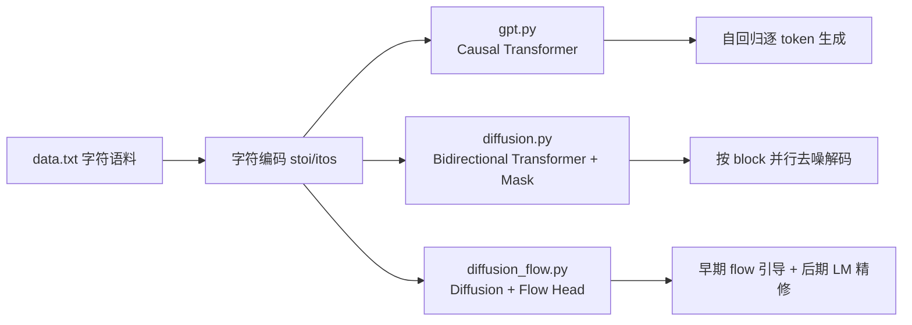

# tiny-diffusion

一个用于字符级文本生成的小型实验仓库，包含三类模型实现：

- `gpt.py`：自回归基线（causal attention）。
- `diffusion.py`：语言扩散基线（并行解码，mask 去噪）。
- `diffusion_flow.py`：在扩散基线上加入 flow loss 与 flow-assisted decoding 的增强版。

核心目标是用尽量少的代码复现并对比「自回归 vs 扩散 vs 扩散+flow」在速度、解码步数和文本质量上的差异。

## 当前模型架构图

### 总览



### GPT / Diffusion / Diffusion+Flow 结构关系

```mermaid
flowchart TD
    subgraph Shared[共享主干（3个脚本都在用）]
      S1[Token Embedding]
      S2[RMSNorm]
      S3[Transformer Blocks x6\nRoPE + QK Norm]
      S4[LM Head]
      S1 --> S2 --> S3 --> S4
    end

    subgraph GPT[gpt.py]
      G1[is_causal=True]
      G2[CE(next token)]
      G3[逐 token 采样]
      G1 --> G2 --> G3
    end

    subgraph Diff[diffusion.py]
      D1[mask token '_' + 随机mask]
      D2[is_causal=False]
      D3[CE(仅masked位置)]
      D4[置信度阈值并行解码]
      D1 --> D2 --> D3 --> D4
    end

    subgraph Flow[diffusion_flow.py]
      F1[在 Diffusion 上新增 flow_head + t_mlp]
      F2[CE + lambda * flow loss]
      F3[flow-assisted decoding]
      F1 --> F2 --> F3
    end

    Shared --> GPT
    Shared --> Diff
    Diff --> Flow
```

## 环境准备

### 1) 安装依赖

需要 Python `>=3.10`。

```bash
uv sync
```

### 2) 准备数据

仓库默认读取根目录 `data.txt`（Tiny Shakespeare 文本）。你可以使用公开文件：

```bash
wget https://github.com/nathan-barry/tiny-diffusion/releases/download/v2.0.0/data.txt
```

### 3) 准备权重（可选）

如果不训练，直接推理需要已有权重文件，默认路径：

- `weights/gpt.pt`
- `weights/diffusion.pt`
- `weights/diffusion_flow.pt`

没有权重时可以直接运行训练命令自动生成。

## 快速开始

### 推理生成

```bash
# GPT
uv run gpt.py

# Diffusion baseline
uv run diffusion.py

# Diffusion + Flow
uv run diffusion_flow.py
```

说明：

- 三个脚本默认从 `data.txt` 前 `prompt_len=16` 个字符作为开头。
- 默认会生成约 2000 个新字符（见各脚本末尾 `generate(...)` 调用）。

## 运行流程（重构后说明，不改命令）

### 标准闭环

1. 准备 `data.txt` 与依赖（`uv sync`）。
2. 训练生成权重（`weights/*.pt`）。
3. 用主脚本推理抽样（`gpt.py` / `diffusion.py` / `diffusion_flow.py`）。
4. 用分析脚本做对比评估与可视化（`evaluate_*` / `run_inference_*` / `analyze_*` / `plot_training_curves.py` / `visualize.py`）。

### 目录产物一览

- `weights/`：模型参数
- `logs/`：训练日志 CSV（diffusion 系列）
- `eval_reports/`：baseline vs flow 评估结果
- `infer_reports/`：推理 sweep 原始结果
- `infer_analysis/`：sweep 聚合分析与图表
- `plots/`：训练曲线图

### 从头训练

```bash
# GPT（默认 5000 iter）
uv run gpt.py --train

# Diffusion baseline（默认 10000 iter）
uv run diffusion.py --train

# Diffusion + Flow（默认 10000 iter）
uv run diffusion_flow.py --train
```

训练输出：

- 权重保存到 `weights/*.pt`
- `diffusion.py` 与 `diffusion_flow.py` 会写训练日志到 `logs/*.csv`

## 可视化

`visualize.py` 支持扩散过程逐步动画，以及与 GPT 的并排对比：

```bash
# 仅看 diffusion baseline
uv run visualize.py

# 看 flow 版本
uv run visualize.py --flow

# 与 GPT 对比
uv run visualize.py --compare

# 保存为 GIF（无图形界面环境推荐）
uv run visualize.py --flow --compare --save outputs/flow_vs_gpt.gif --fps 24
```

常用参数：

- `--blocks` 生成块数（默认 5）
- `--prompt-len` 提示长度（默认 16）
- `--flow-step` flow 可视化步长（默认 0.6）

## 实验与评估脚本

### 1) baseline vs flow 总评估

```bash
uv run evaluate_flow_vs_baseline.py \
  --baseline-weights weights/diffusion.pt \
  --flow-weights weights/diffusion_flow.pt \
  --seeds 1337,2027,7
```

输出到 `eval_reports/<timestamp>/`，包含：

- `summary.json`
- `samples_baseline.csv`
- `samples_flow.csv`
- `blind_samples.csv`
- `blind_key.csv`

### 2) 推理参数网格搜索

```bash
uv run run_inference_sweep.py \
  --module diffusion_flow \
  --weights weights/diffusion_flow.pt \
  --seeds 1337,2027 \
  --temp 0.7,0.8 \
  --confidence-threshold 0.75,0.85,0.95 \
  --top-k 2,3
```

输出到 `infer_reports/<module>_<timestamp>/`，包含 `results.csv`、`results.json`、`samples.txt`。

### 3) Sweep 结果分析

```bash
uv run analyze_inference_sweep.py \
  --inputs infer_reports/.../results.json \
  --tag flow_sweep
```

输出到 `infer_analysis/`，包含聚合表、Pareto 表和散点图（速度-并行度、速度-质量）。

### 4) 训练曲线对比

```bash
uv run plot_training_curves.py \
  --baseline-log logs/diffusion_train_xxx.csv \
  --flow-log logs/diffusion_flow_train_xxx.csv \
  --tag run1
```

输出到 `plots/`，包括 train/val loss、batch loss、flow breakdown、val-vs-time。

### 5) 预设参数一键推理

```bash
uv run run_inference_preset.py --preset flow_quality
uv run run_inference_preset.py --preset flow_balanced
uv run run_inference_preset.py --preset baseline_fast
```

预设配置位于 `configs/inference_presets.json`。

### 6) 同权重下两种 generate 逻辑 A/B 对比

```bash
uv run evaluate_generate_methods.py \
  --module diffusion \
  --weights weights/diffusion.pt \
  --seeds 1337,2027,7,42,123 \
  --a-name old_like \
  --a-confidence-threshold 0.85 \
  --a-draft-threshold 0.85 \
  --a-confirm-threshold 0.85 \
  --a-replace-margin 1.0 \
  --a-target-chunk-len 240 \
  --b-name new_two_stage \
  --b-confidence-threshold 0.95 \
  --b-draft-threshold 0.70 \
  --b-confirm-threshold 0.85 \
  --b-replace-margin 0.0 \
  --b-target-chunk-len 240
```

输出到 `eval_generate_reports/<module>_<timestamp>/`，包含 `summary.json`、`results.json`、`results.csv`。

### 7) generate A/B 结果质量检查

```bash
uv run analyze_generate_quality.py \
  --input eval_generate_reports/diffusion_xxx/results.json \
  --tag diffusion_ab
```

输出到 `eval_generate_quality/`，包含 `diffusion_ab_summary.json`、`diffusion_ab_rows.json`。

### 8) new_two_stage 参数网格 + baseline 对比

```bash
uv run sweep_new_two_stage_vs_baseline.py \
  --module diffusion \
  --weights weights/diffusion.pt \
  --seeds 1337,2027,7,42,123,314,2718,9001,65537,8888 \
  --sweep-draft-threshold 0.20,0.30,0.40,0.50,0.60,0.70 \
  --sweep-confirm-threshold 0.85,0.88 \
  --sweep-replace-margin 0.0,0.02,0.05 \
  --sweep-target-chunk-len 240
```

输出到 `sweep_generate_reports/<module>_<timestamp>/`，包含：

- `run_level.json`：逐 seed 明细（new vs baseline）
- `agg_vs_baseline.json`：每组参数的均值差异汇总
- `summary.json`：配置与 top5 参数
- `speed_vs_quality.png`：速度-质量散点图
- `speed_vs_parallel.png`：速度-并行度散点图
- `top_speed_configs.png`：最快配置条形图

## 代码结构

- `gpt.py`：自回归模型训练与生成
- `diffusion.py`：语言扩散 baseline 训练与并行生成
- `diffusion_flow.py`：flow loss + flow decode 增强版
- `visualize.py`：动画可视化
- `evaluate_flow_vs_baseline.py`：基线与 flow 对比评估
- `run_inference_sweep.py`：推理参数网格搜索
- `analyze_inference_sweep.py`：sweep 统计分析与绘图
- `plot_training_curves.py`：训练日志绘图
- `run_inference_preset.py`：加载预设参数推理
- `evaluate_generate_methods.py`：同权重下两种 generate 参数集 A/B 对比
- `analyze_generate_quality.py`：对 A/B 生成结果做质量指标统计
- `sweep_new_two_stage_vs_baseline.py`：new_two_stage 参数网格并和 baseline 对比

## 致谢

`gpt.py` / `diffusion.py` 的实现思路参考了 Andrej Karpathy 的公开 GPT 教学实现：

- https://github.com/karpathy/nanochat/blob/master/nanochat/gpt.py
- https://github.com/karpathy/ng-video-lecture/blob/master/gpt.py

## License

MIT
